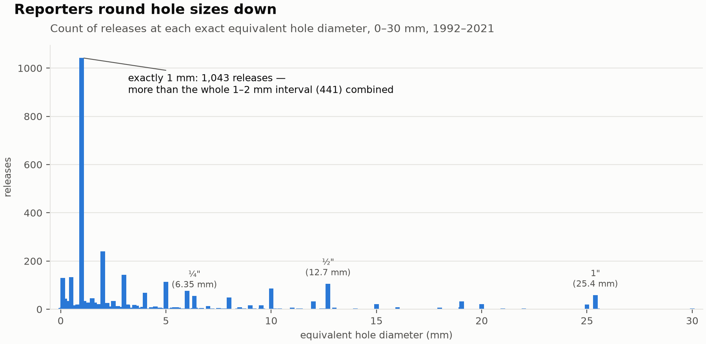
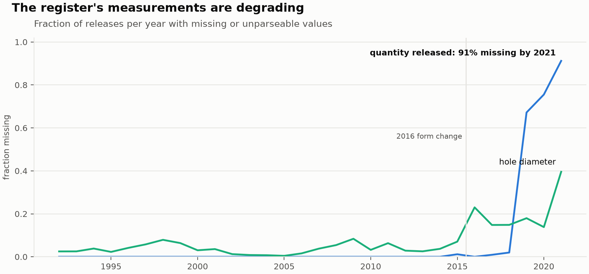

# hcr-pipeline

[](https://github.com/louisgrochla/hcr-pipeline/actions/workflows/ci.yml)

A reproducible cleaning and quality-profiling pipeline for the UK
offshore **Hydrocarbon Release (HCR) register** — HSE's public record of
every reported loss-of-containment event on UK Continental Shelf
installations since October 1992.

The register is the North Sea's anomaly log: 5,278 releases across
three decades, two incompatible published schemas, and every kind of
real-world mess — sentinel strings, free text in coded fields, rounded
measurements, criteria changes mid-series. This repository turns it
into an analysable dataset **without hiding any of that**: every
transformation is a named, tested function; every judgement call is
documented; every data-quality defect is quantified rather than
silently fixed.

**The deliverable is [`reports/data_quality.md`](reports/data_quality.md)**
— two pages on what the data is, what is wrong with it, what was done
about it, and what a downstream analyst must know before trusting it.

## Headline findings

- **The 2016 reporting-form change broke the cause taxonomy**: 50% of
  2016–2021 records carried cause entries resolvable to no known
  category; documented consolidation recovers this to 17%.
- **Physical measurement content is degrading**: released quantity is
  91% missing by 2021; hole diameter 40% missing/unparseable.
- **The hole-size round-down artefact, quantified**: 60.5% of all
  values in [1, 2] mm sit at exactly 1.0 mm; imperial spikes at
  ¼″/½″/1″/2″ reveal two measurement cultures in one column.
- **Severity is not comparable across the 1999 criteria change**: the
  MINOR/SIGNIFICANT split flips at the boundary (33%/59% → 58%/39%).
- Among serious releases 1999–2015, recorded operational and procedural
  involvement rose materially while equipment causes stayed flat
  ([`reports/analysis.md`](reports/analysis.md)).
- **The broken post-2016 cause codes cannot be recovered by NLP** — a
  text classifier trained on 3,190 human-coded narratives barely beats
  the majority baseline on every cause target, showing the codes carry
  investigation knowledge that is not in the text
  ([`reports/cause_recovery.md`](reports/cause_recovery.md)).





Figures are generated by `hcr.plots` (`plots.save_all(df)`) — no
hand-edited images.

## Structure

```
├── data/raw/                 HSE files, byte-for-byte as published
├── src/hcr/
│   ├── ingest.py             read raw spreadsheets; inventory; no cleaning
│   ├── schema.py             canonical schema, two-era column mapping,
│   │                         observed sentinels & permitted sets
│   ├── clean.py              named transformations: sentinels, normalisation,
│   │                         synonym consolidation, coercion, dedup
│   ├── validate.py           rules returning failing rows, never booleans
│   └── profile.py            missingness, drift, distribution profiling
├── tests/                    46 tests against synthetic fixtures
├── notebooks/01_eda.ipynb    exploration only; nothing load-bearing
└── reports/
    ├── data_quality.md       THE deliverable (2 pages, client-facing)
    ├── inventory.md          what the raw files actually contain
    ├── schema_mapping.md     every mapping judgement, with rationale
    ├── profiling.md          quantified data-quality findings
    └── analysis.md           one question, answered with stated method
```

## Usage

```bash
pip install -e ".[dev]"
pytest                # 46 tests
ruff check .
```

```python
import pandas as pd
from hcr import ingest, clean, validate

ingest.inventory()    # per file: format, sheets, rows, columns, parse status

df = pd.concat(
    [clean.clean_records(t["frame"], year=t["years"][0])
     for t in ingest.load_source_tables()],
    ignore_index=True,
)                     # 5,278 canonical records, 1992–2021

validate.run_all(df)  # rule, status, failures, pass rate
```

Design choices worth knowing: validation rules return the **failing
rows** so defects stay inspectable; cleaning never touches the raw
files; category consolidation is an explicit reviewable table
(`schema.CATEGORY_SYNONYMS`) restricted to meaning-preserving fixes —
free text that cannot be honestly recovered stays failing, and the
failure count is itself a published finding.

## Data provenance

- **Source:** HSE offshore hydrocarbon release statistics (UK Health and
  Safety Executive, offshore statistics pages).
- **Licence:** Open Government Licence v3.0; raw files redistributed
  unmodified with attribution to HSE.
- **Retrieved:** 2026-07-13, from:
  - `hsr1992–2014.xlsx` — [UK Government Web Archive capture of
    hse.gov.uk](https://webarchive.nationalarchives.gov.uk/ukgwa/20221106163434mp_/https://www.hse.gov.uk/offshore/statistics/hsr1992%E2%80%932014.xlsx)
    (linked from HSE's offshore statistics page as "Offshore Hydrocarbon
    Releases 1992 – 2016"; the rows actually cover releases to
    31 Dec 2015 — see `reports/inventory.md`).
  - `hcr2016-2021.xlsx` —
    [hse.gov.uk](https://www.hse.gov.uk/offshore/assets/docs/hcr2016-2021.xlsx)
    ("Offshore Hydrocarbon Releases 2016 – 2021"; 2021 marked
    provisional by HSE).
