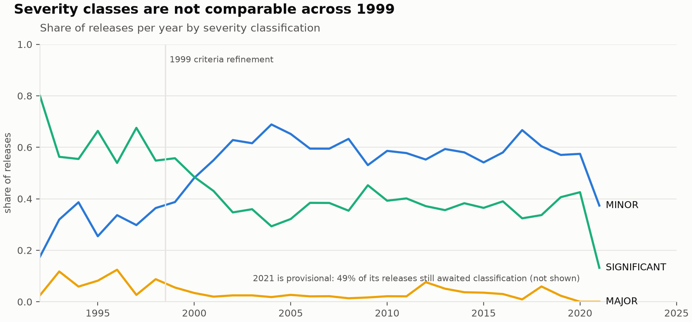

# UK Offshore Hydrocarbon Release Register — Data Quality Assessment

*Prepared from HSE's published HCR data, October 1992 – December 2021
(5,278 release records). Pipeline, evidence and reproduction steps:
this repository. Detailed workings: `inventory.md`, `schema_mapping.md`,
`profiling.md`, `analysis.md`.*

## What this data is

The Hydrocarbon Releases (HCR) database is the UK offshore industry's
loss-of-containment register: every reported release of hydrocarbons on
UK Continental Shelf installations since 1 October 1992, categorised by
severity, cause, equipment, hole size, and operational context. It was
created on Lord Cullen's recommendation after Piper Alpha, specifically
to feed quantified risk assessment (QRA). Supplementary detail is
reported **voluntarily** (form OIR/12, checked against RIDDOR OIR/9B) —
a fact that qualifies every number derived from it.

HSE publishes it as two spreadsheets with **incompatible schemas and no
overlapping column names**: a 1992–2015 extract (118 coded fields, one
table) and a 2016–2021 extract (150 free-er fields, one sheet per
year). Even establishing coverage required inspection: the older file's
link label says "1992–2016", its filename says 2014, its own
introduction says 2014 — the rows run to 31 December 2015. There is no
gap: coverage is continuous to 2021 (2021 provisional). Nothing
row-level is published after 2021.

## What is wrong with it

**1. The 2016 form change broke the cause taxonomy.** Era 1 codes
causes against closed lists (6 equipment-failure values). Era 2 records
the same fields as free text: typos ("IMPROPER MAINTENACE", "DEFICENT
PROCEDURE"), case drift, and whole sentences pasted into category
fields. Before cleaning, 50% of 2016–2021 records had at least one
cause entry that resolves to no known category; conservative,
documented consolidation recovers this to 17%. The residual is
unrecoverable without re-coding source reports.

**2. Physical measurements are degrading.** Released quantity is
missing for 67% of 2019 records, 76% of 2020, 91% of 2021 — effectively
unusable after 2018. Hole diameter, near-complete in era 1 (3.6%
missing), is 20% missing/unparseable in era 2, including entries like
"1mm", "<5", and "Two holes: 10mm and 5mm" typed into a numeric field.

**3. Hole sizes are rounded, not measured.** Of all releases with an
equivalent hole diameter between 1 and 2mm inclusive, 60.5% sit at
exactly 1.0mm (1,043 records) against 25.6% in the entire open interval
— a round-down step no physical process produces. Spikes at 6.35, 12.7,
25.4 and 50.8mm (¼″–2″) show a second, imperial, measurement culture.
QRA frequency curves built on these values inherit both artefacts.

**4. Severity is not comparable across 1999.** Classification criteria
were introduced in 1997 and refined in 1999; pre-1997 records were
classified retroactively. The MINOR/SIGNIFICANT split flips at the 1999
boundary (33%/59% before, 58%/39% after) — an artefact of the rules,
not the world. 45 of the 91 provisional 2021 records still await
classification.

**5. Assorted structural traps**, all handled in the pipeline: missing
values encoded as the literal string "BLANK" (43,149 cells); hole-size
unknowns encoded as 999 (163 records — poisonous in any average);
16 fully empty rows padding the 2016 sheet; phantom columns created by
stray keystrokes; categories split by trailing whitespace ("NORMAL
PRODUCTION  " vs "NORMAL PRODUCTION"); a record predating the register's
official start; 1992 is a quarter-year (40 records), not a quiet year.

## What was done about it

A tested Python package (`hcr`) makes the register analysable without
hiding its problems: raw files are preserved byte-for-byte with
provenance; a canonical 23-field schema maps both eras with every
judgement documented; cleaning is a sequence of named, unit-tested
transformations (sentinels → NA, lossless case/whitespace
normalisation, an explicit synonym table for typo-level consolidation
only); four validation rules return the *failing rows* — currently 2
implausible hole sizes, 1 invalid severity, 1 out-of-period date, and
107 unresolvable cause entries, each a documented finding rather than a
silent fix. Deliberate releases cannot be reliably identified in the
public data; a documented `non_process` proxy flag is provided and
nothing is dropped.

## What a downstream analyst must know before trusting it

1. **State coverage with every result.** Voluntary reporting, declining
   volume (~270/yr early 2000s → ~100/yr 2010s), and era-2 cause
   coverage of ~83% mean shares need denominators alongside.
2. **Never cross 1999 with severity trends**, and exclude or annualise
   1992.
3. **Treat 1–2mm hole sizes as a band**, not point values; expect
   imperial anchors.
4. **Do not use released quantity after 2018.**
5. **Do not compare cause categories across 2016** without the
   consolidation table in `schema_mapping.md` — and quote its residual.

Within those limits the register supports real analysis. Example
(method and caveats in `analysis.md`): among serious releases
(MAJOR/SIGNIFICANT, process, 1999–2015), recorded operational-failure
involvement rose from 47% to 55% and procedural from 24% to 33% between
1999–2007 and 2008–2015, while equipment involvement stayed flat at
~70% — a shift toward human-and-organisational factors in the recorded
causes of serious releases, though a change in coding practice cannot
be excluded.
